**INTEGRANTES**  
Vicente Garzon Rios.  
Daniel Alejandro Diaz.

**PREGUNTAS**  
2.6. Al intentar subir un cambio al tiempo se presento un conflicto, en donde a uno si le dejo subir sus cambios mientras que al otro no lo dejo.
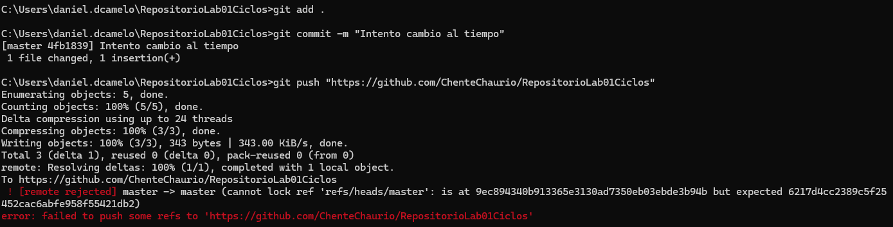
3.1. No existe una forma de evitar completamente los conflictos, pero sí de minimizarlos mediante el uso de ramas bien definidas, sincronizando frecuentemente con la rama principal, realizando commits claros y pequeños, y coordinando con el equipo de trabajo. Además, usar herramientas de revisión como los pull requests ayuda a detectar problemas antes de fusionar las ramas.
3.2. Un Pull Request es una solicitud para fusionar un conjunto de cambios de una rama a otra en un repositorio de código. Generalmente, esta solicitud se realiza cuando un desarrollador quiere integrar sus cambios en la rama principal de un proyecto.

**PASOS**  
1. Abrir el cmd.
2. Crear la carpeta que sera mi repositorio con mkdir.

3. Realizar el git init.
4. Crear el archivo README.
5. Investigar sobre los comandos add y commit.
6. Realizar add al archivo README.
7. Realizar un commit.

8. Enlazar el correo institucional.
9. Crear el repositorio en Git.

10. Configurar el repositorio local con el remoto.
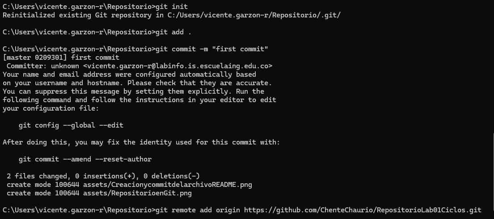
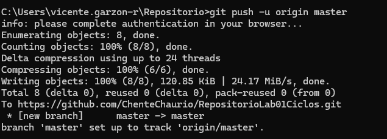
11. Realizando la actualizacion de cambios en el Repositorio.
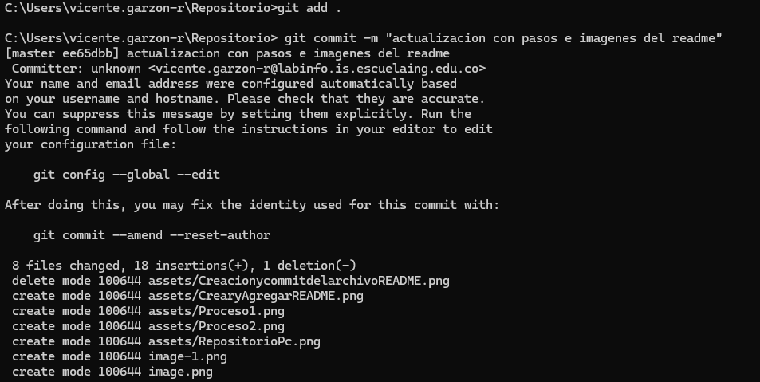
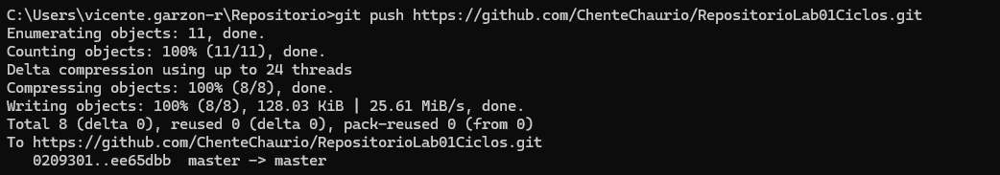
12. Configurar el Git local con el correo de la Universidad.
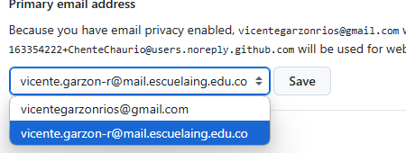
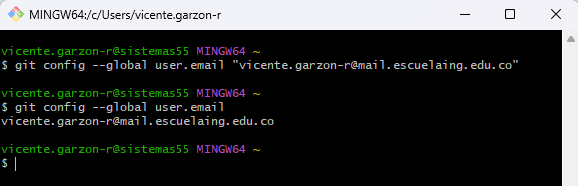
13. Subir los cambios.
14. Agregando al colaborador con permisos.
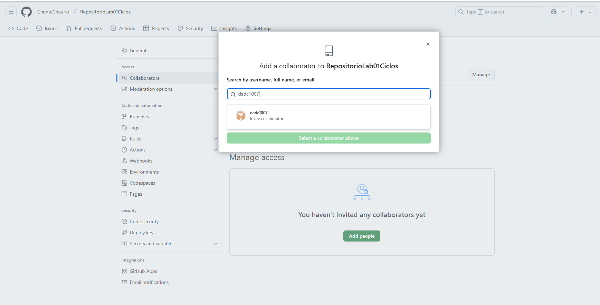
15. Se intento subir un cambio al mismo tiempo pero hubo un conflicto.

16. Se resolvio el conflicto usando VS code.
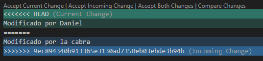
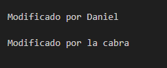
17. Crear ambas ramas.
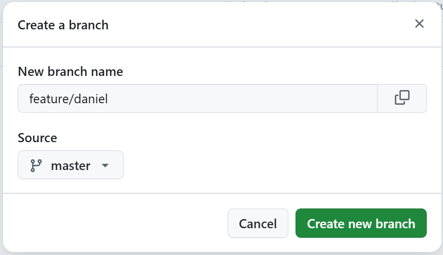
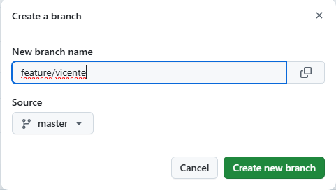
18. Cada uno sube sus cambios a sus respectivas ramas.
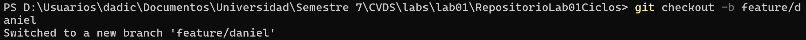
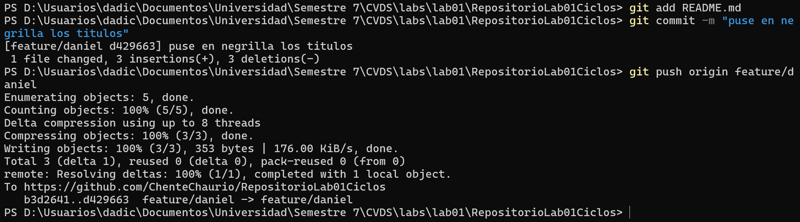
19. Cada uno hace un pull request a la rama master.
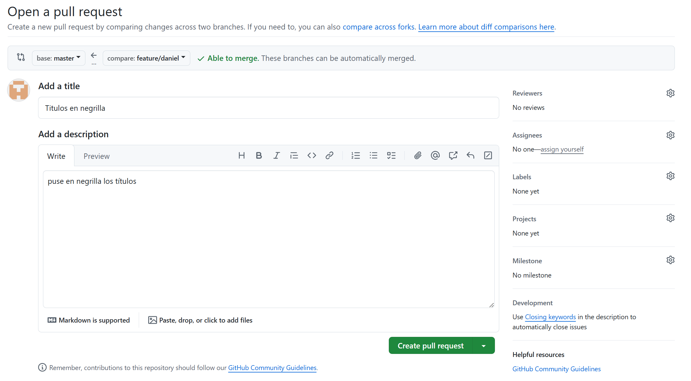
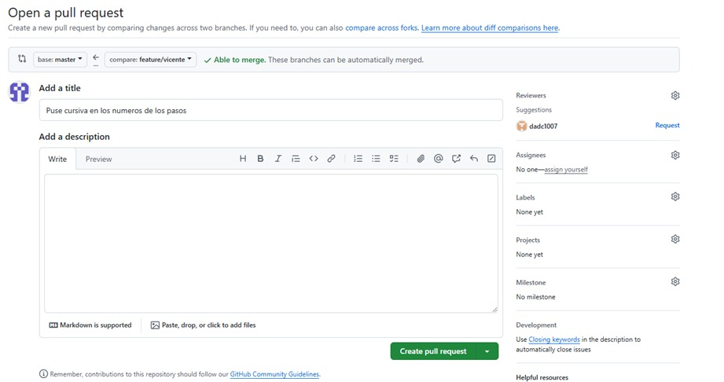
20. Mezclar los cambios a la rama master a traves de PR.
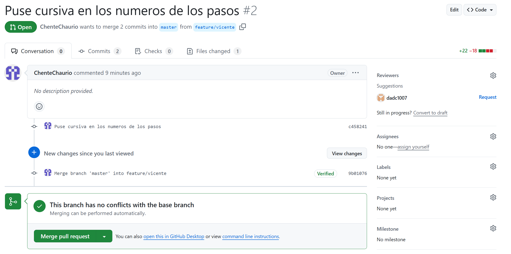
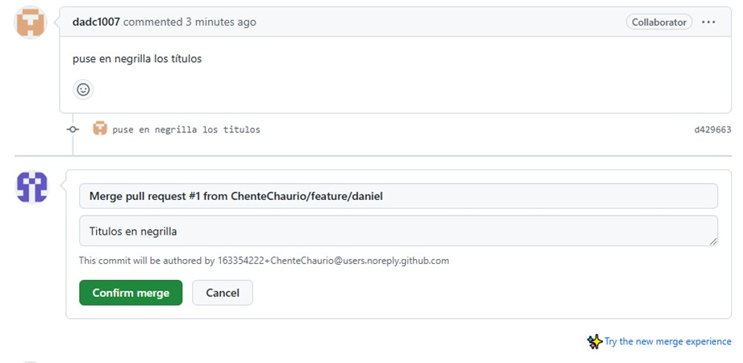

