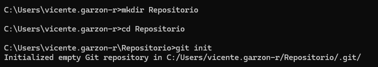
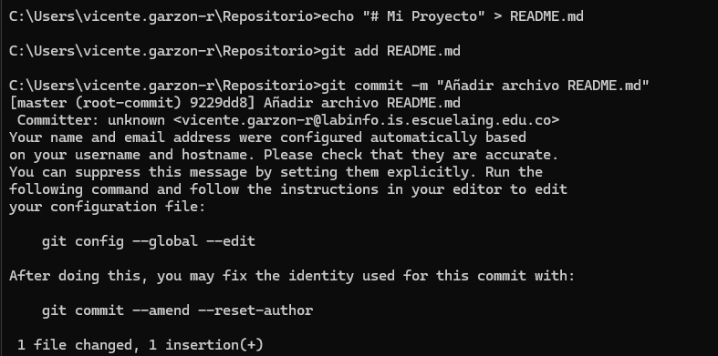

Pasos
1. Abrir el cmd.
2. Crear la carpeta que sera mi repositorio con mkdir.

3. Realizar el git init.
4. Crear el archivo README
5. Investigar sobre los comandos add y commit.
6. Realizar add al archivo README
7. Realizar un commit.

8. Enlazar el correo institucional.
9. Crear el repositorio en Git

10. Configurar el repositorio local con el remoto.

